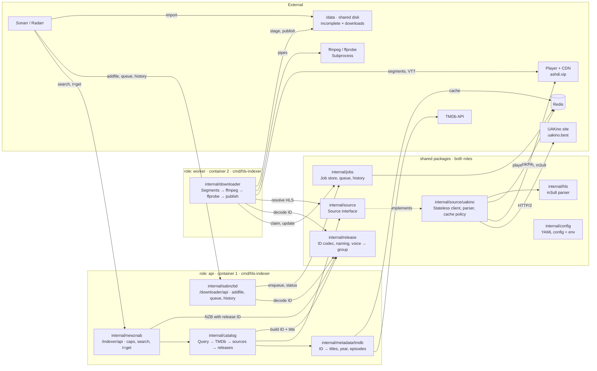

# Architecture overview

HLS Indexer is one Go binary, `cmd/hls-indexer`, with two roles:

| Role | Container | Does |
|---|---|---|
| `api` | `api` | Serves `/indexer/api` (Newznab) and `/downloader/api` (SABnzbd). Runs searches and accepts jobs. |
| `worker` | `worker` | Claims jobs, downloads HLS, muxes MKV, publishes to `/data/downloads`. |

Both roles share Redis and the `/data` volume. They talk only through Redis jobs.

## Modules

| Package | Responsibility | Boundary |
|---|---|---|
| `internal/newznab` | Newznab XML: caps, search, `t=get` | Protocol only. Calls `catalog`. |
| `internal/sabnzbd` | SAB JSON: config, `addfile`, queue, history, retry, delete | Protocol only. Calls `jobs`. |
| `internal/catalog` | Search flow from request to sorted releases | Only package that combines TMDb and sources |
| `internal/metadata/tmdb` | TMDb ID lookup, titles, episode lists, absolute → season/episode | Caches its own data |
| `internal/release` | Release ID codec, release title, voice → group | Pure functions, no I/O |
| `internal/source` | `Source` interface and shared types: title, voice, episode, stream | No source-specific fields |
| `internal/source/uakino` | UAKino client, parser, cache policy | UAKino types never leave this package |
| `internal/hls` | Master and media m3u8 parsing, best variant | Pure functions, no I/O |
| `internal/jobs` | Job store, priority queue, history, dedup | Only package that touches job keys |
| `internal/downloader` | Resolve → download → mux → validate → publish | Only package that runs ffmpeg |
| `internal/config` | Merge defaults, override file and env | Layers and keys: README |

## Source interface

A source turns a query into titles and a release coordinate into a playable stream. Each source owns its HTTP client, parsing, IDs and cache policy. A new source adds `internal/source/<name>`, plus one registration.

| Operation | Returns |
|---|---|
| Search titles | Candidates: title ID, names, year, season, kind |
| Load a title | Voices with episodes. Takes the expected episode count for cache decisions. |
| Sample an episode | Best variant resolution, bandwidth and duration, for release quality and size |
| Resolve an episode or movie voice | HLS master URL and subtitle tracks |

`internal/catalog` holds the list of sources. A release ID prefix must name one of them, else `t=get` answers `300`.

## Deployment

- Dockerfile stages: `golang:1.27.1` builds with `CGO_ENABLED=0` → `mwader/static-ffmpeg:9.0.2` supplies `ffmpeg` and `ffprobe` → `gcr.io/distroless/static-debian13` runtime. Binaries live in `/usr/local/bin`. The binary embeds `config/default.yaml`. The image also ships it at `/etc/hls-indexer/default.yaml`.
- The entrypoint is `hls-indexer`, the command is the role: `api` (default) or `worker`. Both roles ping Redis at start and exit on failure. The api uses Redis for the TMDb cache and refuses to start without both API keys.
- `compose.yaml` runs `redis` (AOF on), `api` and `worker` from one image, with a shared `./data:/data` volume. `redis-test` (profile `test`, port 6380, no persistence) serves tests only.
- `internal/app` wires the roles. `internal/testenv` is the S1 test harness: in-process API and worker, fake UAKino and TMDb servers, test Redis from `TEST_REDIS_URL`.

## Details

- [api-contract.md](api-contract.md): Newznab and SABnzbd behaviour.
- [releases.md](releases.md): release ID, naming, search flow.
- [downloader.md](downloader.md): job lifecycle and HLS → MKV pipeline.
- [storage.md](storage.md): Redis data.
- [../uakino/](../uakino/): UAKino requests and rules.
